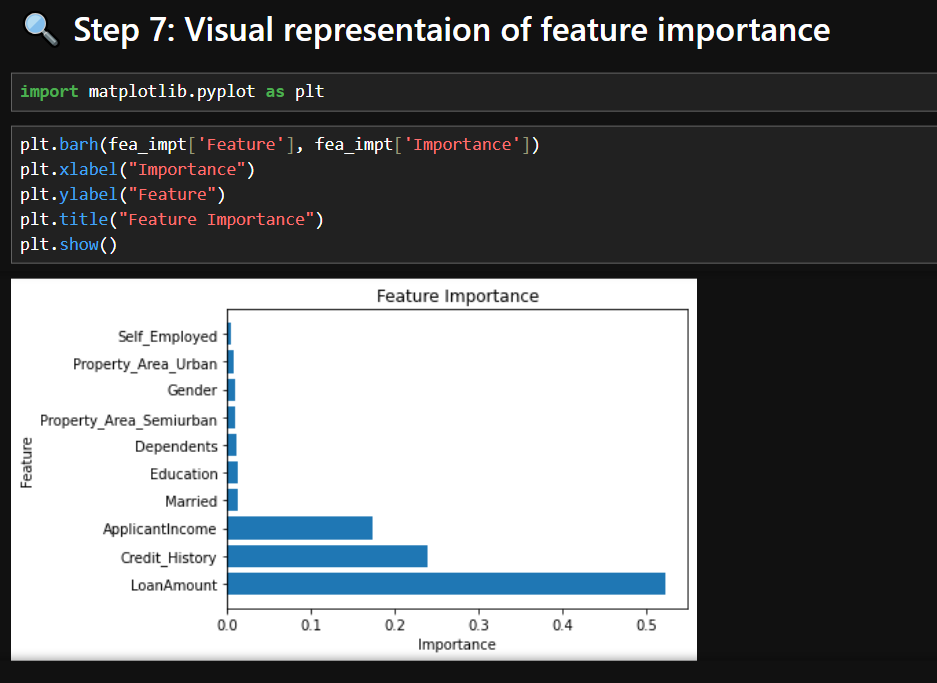

# Loan-Prediction-ML
Machine Learning project for loan approval prediction

# Loan Approval Prediction System

## 📌 Project Overview
This project predicts whether a loan will be approved or not using machine learning.

## 🚀 Models Used
- Logistic Regression
- Random Forest
- XGBoost

## 📊 Results
- Logistic Regression: 92.5%
- Random Forest: 95%
- XGBoost: 97.5%

## 🔑 Key Features
- Data preprocessing
- Feature engineering
- Model comparison
- Feature importance

## 💡 Key Insight
Loan Amount, Applicant Income, and Credit History are the most important features.

## 📊 Visual Representation

